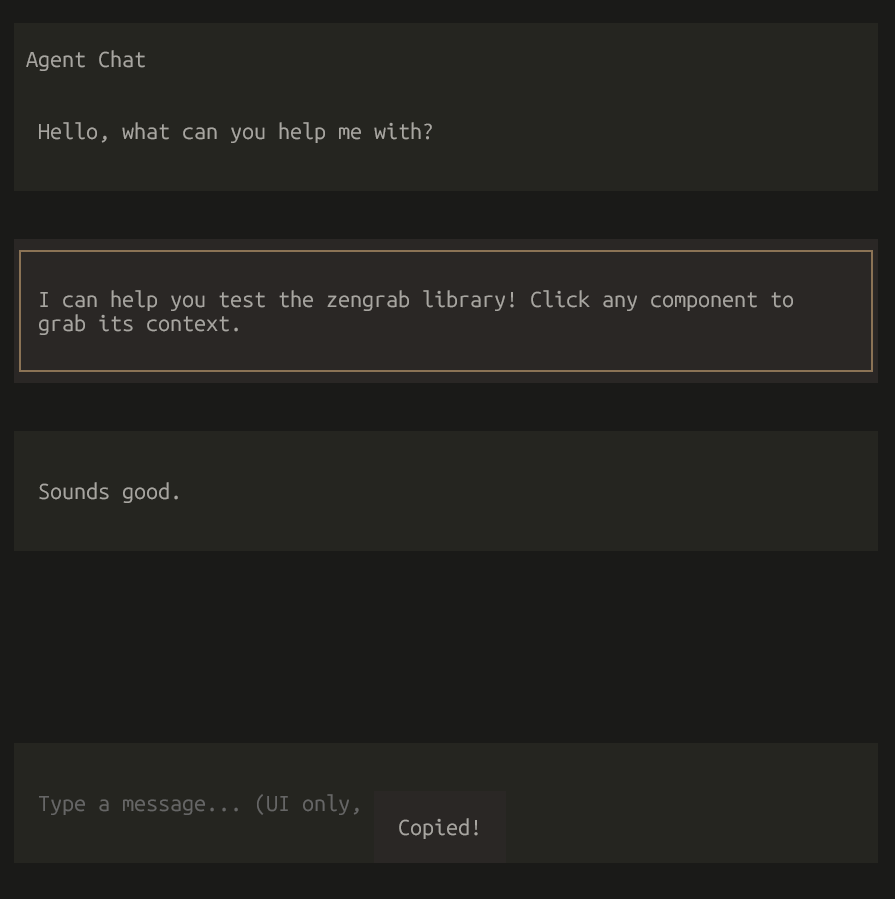

# zengrab

Select context for coding agents directly from OpenTUI apps.

Click any component in your terminal UI to copy its component name, type, and hierarchy to your clipboard—ready to paste into Cursor, Claude Code, Copilot, or any coding agent.



## Usage

### Auto-init (recommended)

Call `initZengrab(renderer)` and add `captureHandler` to `onMouseDown` and `hoverHandler` to `onMouseMove` of a Box wrapping your UI. Hover highlights the element; click to grab it.

```ts
import { createCliRenderer, Box, Text } from "@opentui/core";
import { initZengrab } from "zengrab";

const renderer = await createCliRenderer({ exitOnCtrlC: true });
const zengrab = initZengrab(renderer);

renderer.root.add(
  Box(
    {
      id: "app",
      onMouseDown: zengrab.captureHandler,
      onMouseMove: zengrab.hoverHandler,
      flexDirection: "column",
      flexGrow: 1,
    },
    Text({ content: "Click me to grab" })
  )
);

// Hover = highlight border. Click = grab. Ctrl+Alt+G = toggle zengrab on/off
```

### Required: wrap your UI

Add `zengrab.captureHandler` to `onMouseDown` and `zengrab.hoverHandler` to `onMouseMove` of a Box that wraps your UI. The hovered element is highlighted with a border; click any component to grab it.

```ts
Box(
  {
    onMouseDown: zengrab.captureHandler,
    onMouseMove: zengrab.hoverHandler,
    flexDirection: "column",
  },
  Text({ content: "Click me to grab" })
)
```

### Manual grab

Use `grabAndCopy` or `grabContext` when you need more control:

```ts
import { createCliRenderer } from "@opentui/core";
import { grabAndCopy, grabContext, grabContextFromRenderable } from "zengrab";

const renderer = await createCliRenderer();

// Grab focused component
await grabAndCopy(renderer);

// Grab a specific renderable (e.g. from click event)
const context = grabContextFromRenderable(event.target);
if (context) await grabAndCopy(renderer, event.target);
```

### Options

```ts
const zengrab = initZengrab(renderer, {
  toggleShortcut: { ctrl: true, alt: true, name: "g" },
  enabled: true,
  hoverBorderColor: "#58A6FF",
  showToast: true,        // toast on copy (default: true)
  toastMessage: "Copied!",
  toastDuration: 2000,
  onCopy: (context, text) => console.log("Copied:", text),
  onToggle: (enabled) => console.log("Zengrab:", enabled ? "on" : "off"),
});
```

## Output format

Copied text includes component metadata and, when available, the actual content (code, text, etc.):

```
[CodeRenderable] id="content-block-2" in ScrollBoxRenderable#scroll > ... > MarkdownRenderable#content
// in ScrollBoxRenderable#scroll > ... > MarkdownRenderable#content

# zengrab
Select context for coding agents...
```

## API

- **`initZengrab(renderer, options?)`** – Register shortcuts. Returns `ZengrabInstance` with `enable`, `disable`, `toggle`, `destroy`, `enabled`, `captureHandler`, and `hoverHandler`.
- **`grabContext(renderer, renderable?)`** – Get context for focused or specified renderable.
- **`grabContextFromRenderable(renderable)`** – Get context from any renderable (Text, Box, etc.).
- **`grabAndCopy(renderer, renderable?)`** – Grab and copy to clipboard.

**Interaction:** Hover to highlight (border). Click any component to grab. A toast appears when copied. Ctrl+Alt+G = toggle on/off.

## Development

```bash
bun install
bun run build
bun run dev     # watch mode
bun run example # run example app
```

## License

MIT
